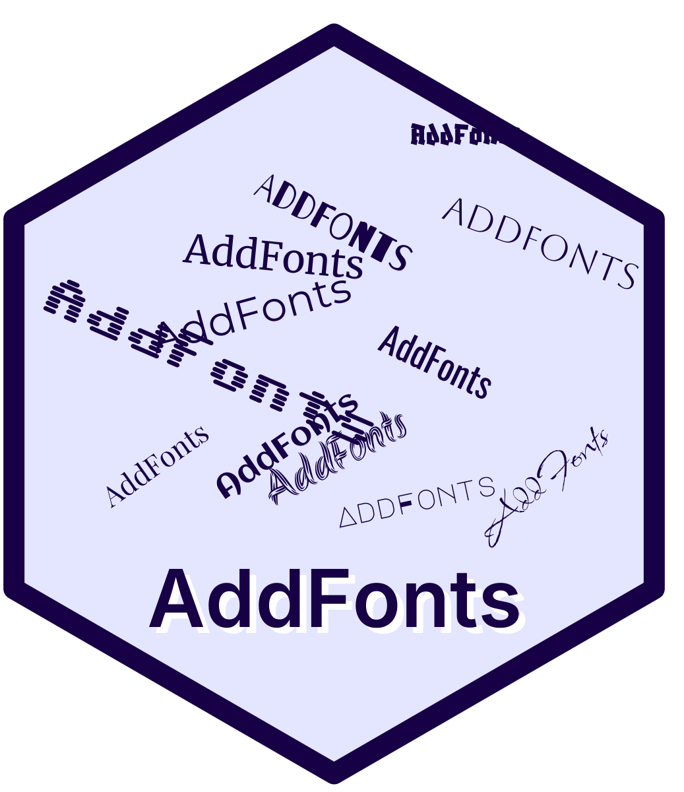
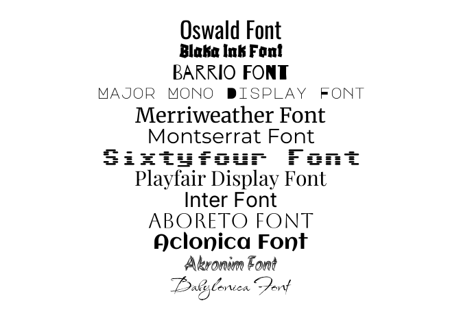

<!-- README.md is generated from README.Rmd. Please edit that file -->

# AddFonts <a href="http://guillaume-noblet.com/AddFonts/"></a>

<!-- badges: start -->

[](https://lifecycle.r-lib.org/articles/stages.html#experimental)
[](https://github.com/gnoblet/AddFonts/actions/workflows/R-CMD-check.yaml)
[](https://app.codecov.io/gh/gnoblet/AddFonts)
[](https://gnoblet.r-universe.dev/AddFonts)
[](https://gnoblet.r-universe.dev/AddFonts)

<!-- badges: end -->

Download and register fonts from GDPR-compliant providers for use in R
graphics. Currently supports [Bunny Fonts](https://fonts.bunny.net/), a
privacy-first alternative to Google Fonts.

## Features

- 🔒 **GDPR-compliant**: Uses Bunny Fonts (no tracking, no data
  collection)
- 📦 **Simple API**: One function to download and register fonts
- 💾 **Smart caching**: Downloads once, reuses forever
- 🎨 **Full variants**: Regular, bold, italic, and bold-italic support

## Installation

``` r
pak::pak("gnoblet/AddFonts")
```

### System Requirements

Requires `woff2` command-line tool to convert fonts:

``` bash
# Debian/Ubuntu
sudo apt install woff2

# Fedora/RHEL
sudo dnf install woff2-tools

# Arch Linux
sudo pacman -S woff2

# macOS
brew install woff2

# Windows
# Go check it out through a web search.
```

## Quick Start

### Preview Fonts With

So, let’s start by going to <https://fonts.bunny.net/> and picking a
font. For example, let’s pick “Merriweather”. We can see that it has 4
variants: regular, bold, italic, and bold-italic. We can use the
`preview_font()` function to see what they look like.

``` r
library(AddFonts)
preview_font("merriweather", regular.wt = 400, bold.wt = 700)
```


### Add Fonts And Use With ggplot2

Let’s make a simple plot using the registered fonts. First, we register
the fonts thanks to the marvelous `add_font()` function.

``` r
library(AddFonts)
library(showtext)
library(ggplot2)

fonts <- c(
  "oswald",
  "blaka-ink",
  "barrio",
  "major-mono-display",
  "merriweather",
  "montserrat",
  "sixtyfour",
  "playfair-display",
  "inter",
  "aboreto",
  "aclonica",
  "akronim",
  "babylonica"
)

for (font in fonts) {
  add_font(font)
}
```

Now that fonts have been registered, we can use them in a plot.

``` r
showtext_auto()

font_data <- data.frame(
  x = 0.5,
  y = seq(0.95, 0.1, length.out = length(fonts)),
  label = paste(tools::toTitleCase(gsub("-", " ", fonts)), "Font"),
  family = fonts,
  size = c(9, 8, 8, 6, 8, 8, 7, 8, 8, 8, 8, 8, 9)
)

ggplot(
  font_data,
  aes(x = x, y = y, label = label, family = family, size = size)
) +
  geom_text(hjust = 0.5) +
  scale_size_identity() +
  xlim(0, 1) +
  ylim(0, 1) +
  theme_void()
```



### Cache Management

``` r
# Get cache location
get_cache_dir()

# Clear specific fonts
cache_clean(families = c("roboto", "open-sans"))

# Clear all fonts
cache_clean(reset = TRUE)
```

## Why Bunny Fonts?

[Bunny Fonts](https://fonts.bunny.net/) is a privacy-focused,
GDPR-compliant alternative to Google Fonts:

- 🔒 No tracking or data collection
- 🚀 Fast global CDN
- 🆓 Free and open-source
- 🎨 Includes most popular Google Fonts

Perfect for EU users or anyone prioritizing privacy.

## How AddFont Works

1.  Downloads WOFF2 files from Bunny Fonts CDN
2.  Converts to TTF format using `woff2_decompress`
3.  Caches locally for reuse
4.  Registers with R via `sysfonts` package

**Why convert?** Bunny Fonts serves WOFF2 (web-optimized), but R’s
`sysfonts` needs TTF format. Conversion happens once; subsequent uses
load instantly from cache.

## Related Packages

- [showtext](https://github.com/yixuan/showtext) - Using fonts in R
  graphics
- [sysfonts](https://github.com/yixuan/sysfonts) - Loading fonts into R
- see also [pyfonts](https://y-sunflower.github.io/pyfonts/) for Python
  by Joseph Barbier.

## License

GPL (\>= 3)

------------------------------------------------------------------------

**Note**: AddFonts is experimental. API may change. Feedback welcome!
