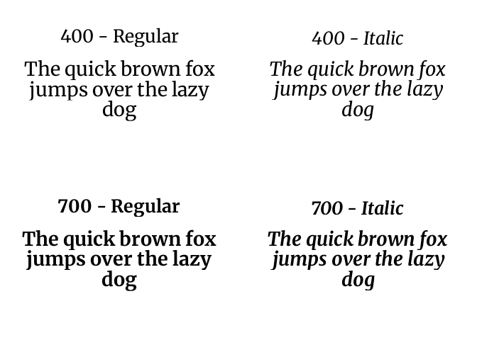
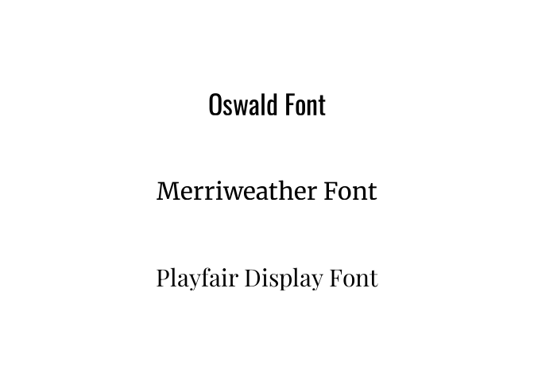

# AddFonts

Download and register fonts in R from multiple sources: Bunny Fonts
(GDPR-compliant CDN), local files, direct URLs, or custom file-based
providers. Fonts are cached on first use and registered via `sysfonts`
so they work immediately with `showtext` and `ggplot2`.

## Features

- 🔒 **Privacy-first default**: Bunny Fonts CDN — no tracking,
  GDPR-compliant
- 📂 **Multiple sources**: CDN providers, local files, direct URLs, or
  custom providers
- 💾 **Smart caching**: Downloads/copies once, reuses across R sessions
- 🎨 **Full variant support**: regular, bold, italic, bold-italic

## Installation

``` r

# From r-universe
install.packages("AddFonts", repos = "https://gnoblet.r-universe.dev")
```

### System Requirements

Requires `woff2` command-line tool to convert fonts:

Click to see installation instructions

``` bash
# Debian/Ubuntu
sudo apt install woff2

# Fedora/RHEL
sudo dnf install woff2-tools

# Arch Linux
sudo pacman -S woff2

# macOS
brew install woff2

# Windows or else
# Compile from: https://github.com/google/woff2
```

## Quick Start

### Add Fonts With One Core Function

To add a font to R, simply call
[`add_font()`](http://guillaume-noblet.com/AddFonts/reference/add_font.md)
with the font family name retrieved from the [Bunny
Fonts](https://fonts.bunny.net/) website. For example, to add the
“Oswald” font:

``` r

library(AddFonts)
# Download and register Oswald font
add_font("oswald")
#> ✔ Converted '/home/gnoblet/.cache/AddFonts/bunny-oswald-latin-400-normal.woff2' to TTF: '/home/gnoblet/.cache/AddFonts/bunny-oswald-latin-400-normal.ttf'
#> ✔ Downloaded variant: 'bunny-oswald-latin-400-normal.ttf'
#> ✔ Converted '/home/gnoblet/.cache/AddFonts/bunny-oswald-latin-700-normal.woff2' to TTF: '/home/gnoblet/.cache/AddFonts/bunny-oswald-latin-700-normal.ttf'
#> ✔ Downloaded variant: 'bunny-oswald-latin-700-normal.ttf'
#> ✔ Font "oswald" registered and added to cache.
```

### Preview Fonts

The
[`preview_font()`](http://guillaume-noblet.com/AddFonts/reference/preview_font.md)
function plots all downloaded and registered variants of a font family
in one go. Once you have picked a font, for instance “Merriweather”,
calling the
[`preview_font()`](http://guillaume-noblet.com/AddFonts/reference/preview_font.md)
function will show you all its variants, and “Merriweather” has 4:
regular, bold, italic, and bold-italic.

``` r

library(AddFonts)
preview_font("merriweather", regular.wt = 400, bold.wt = 700)
```



### Add Fonts And Use With ggplot2

Once fonts are registered, they can be used in ggplot2 via `showtext`.
Here we download three fonts and display them in a plot:

``` r

library(AddFonts)
library(showtext)
library(ggplot2)

fonts <- c("oswald", "merriweather", "playfair-display")

for (font in fonts) {
  add_font(font)
}
```

``` r

showtext_auto()

font_data <- data.frame(
  x = 0.5,
  y = seq(0.75, 0.25, length.out = length(fonts)),
  label = paste(tools::toTitleCase(gsub("-", " ", fonts)), "Font"),
  family = fonts,
  size = c(9, 8, 8)
)

ggplot(
  font_data,
  aes(x = x, y = y, label = label, family = family, size = size)
) +
  geom_text(hjust = 0.5) +
  scale_size_identity() +
  xlim(0, 1) +
  ylim(0, 1) +
  theme_void()
```



### Cache Management

Fonts are stored in a user-level cache directory. Use these functions to
inspect or clear the cache if you need to free disk space or force a
re-download.

``` r

# Show cache location
get_cache_dir()

# Remove a specific font
cache_clean(families = c("oswald"))

# Clear everything
cache_clean(reset = TRUE)
```

## Providers

[`add_font()`](http://guillaume-noblet.com/AddFonts/reference/add_font.md)
supports several font sources via the `provider` argument.

### Bunny Fonts (default)

The default provider. Supply the font family name as it appears on
[fonts.bunny.net](https://fonts.bunny.net/):

``` r

add_font("oswald")
```

### Local files

Pass absolute paths to TTF or OTF files already on disk:

``` r

add_font(
  "my-font",
  provider = "file",
  variants = list(
    regular = "/path/to/MyFont-Regular.ttf",
    bold = "/path/to/MyFont-Bold.ttf"
  )
)
```

### Direct URLs

Download from any URL — no provider account needed:

``` r

add_font(
  "my-font",
  provider = "url",
  variants = list(
    regular = "https://example.com/fonts/MyFont-Regular.ttf"
  )
)
```

### Custom file-based providers

Use
[`FontProviderFile()`](http://guillaume-noblet.com/AddFonts/reference/FontProviderFile.md)
for CDN providers that serve static font files (e.g. Bye Bye Binary):

``` r

bbb <- FontProviderFile(
  source = "bbb",
  base_url = "https://bye.bye.binary.com/fonts/{family}/{filename}.ttf"
)

add_font(
  "alpaga",
  provider = bbb,
  variants = list(regular = "Alpaga-Regular", bold = "Alpaga-Bold")
)
```

## Why Bunny Fonts?

[Bunny Fonts](https://fonts.bunny.net/) is the default provider because
it mirrors most of Google Fonts with no tracking and no data collection
— important for EU users and privacy-conscious projects. It has a fast
global CDN and is free and open-source.

For other font sources, see the [Providers](#providers) section above.

## How AddFonts Works

[`add_font()`](http://guillaume-noblet.com/AddFonts/reference/add_font.md)
follows the same three steps for every provider:

1.  **Check cache** — if the font is already on disk, register it
    immediately and return
2.  **Fetch** — download from a CDN, copy from a local path, or fetch
    from a URL; for Bunny Fonts, also converts WOFF2 → TTF (R’s
    `sysfonts` requires TTF format)
3.  **Register** — calls
    [`sysfonts::font_add()`](https://rdrr.io/pkg/sysfonts/man/font_add.html)
    so the font is available in all graphics devices via `showtext`

In the background, S7 classes manage provider metadata and cache
entries.

## Related Packages

- [showtext](https://github.com/yixuan/showtext) - Using fonts in R
  graphics
- [sysfonts](https://github.com/yixuan/sysfonts) - Loading fonts into R
- [S7](https://github.com/RConsortium/S7) - a new OO system for R
- see also [pyfonts](https://y-sunflower.github.io/pyfonts/) for
  registering fonts in Python (made by Joseph Barbier).

## License

GPL (\>= 3) — see
[LICENSE](http://guillaume-noblet.com/AddFonts/LICENSE)
